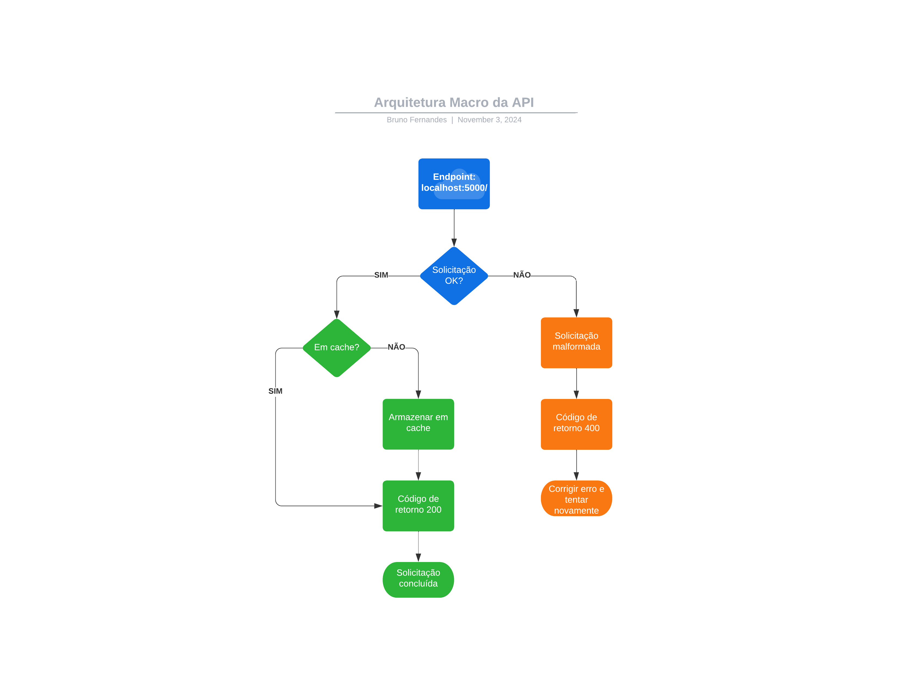

Tech Challenge - Machine Learning Engineering (Fase 1)
==============================

  

<br>

# Descrição do Projeto
API baseado no microframework Flask para consultar dados referentes a quantidade de uvas processadas, produção e comercialização de vinhos, suco e derivados provenientes do Estado do Rio Grande do Sul (Embrapa).<br><br>
Os dados são obtidos por meio de Web Scraping utilizando a biblioteca em Python chamada BeautifulSoup.<br><br>
Fonte: http://vitibrasil.cnpuv.embrapa.br/index.php

<br>

## :heavy_check_mark: Tecnologias Utilizadas

- `Python 3.11.7`
- `Biblioteca Flask 3.0.3`
    - `Flask-Caching 2.3.0`
    - `Flasgger 0.9.7.1`
- `Biblioteca BeautifulSoup4 4.12.3`
- `Biblioteca Pandas 2.2.3`
- `Biblioteca Requests 2.32.3`

<br>

## :hammer: Rotas da API

Após inicializar o servidor localmente, você poderá acessar a documentação em Swagger através do endpoint: http://localhost:5000/apidocs/ <br><br>

De maneira resumida, as rotas ou endpoints são:

- `GET` `/producao/{ano}`: Produção de vinhos, sucos e derivados do Rio Grande do Sul. 
- `GET` `/processamento/{ano}/{tipo_uva}`: Quantidade de uvas processadas no Rio Grande do Sul.
- `GET` `/comercializacao/{ano}`: Comercialização de vinhos e derivados no Rio Grande do Sul
- `GET` `/importacao/{ano}/{tipo_derivado}`: Importação de derivados de uva
- `GET` `/exportacao/{ano}/{tipo_derivado}`: Exportação de derivados de uva

<br>

## :triangular_ruler: Arquitetura Macro da API


<br>

## :gem: Como reproduzir via Python 3

### 1) Realize a instalação das bibliotecas em seu ambiente desejado através do arquivo requirements.txt
```python
pip install -r requirements.txt
```

### 2) Execute o arquivo app.py
```python
python.exe app.py
```

<br>

## :alien: Analista responsável

[<br><sub>Bruno Fernandes</sub>](https://github.com/BrunoFernan1)

